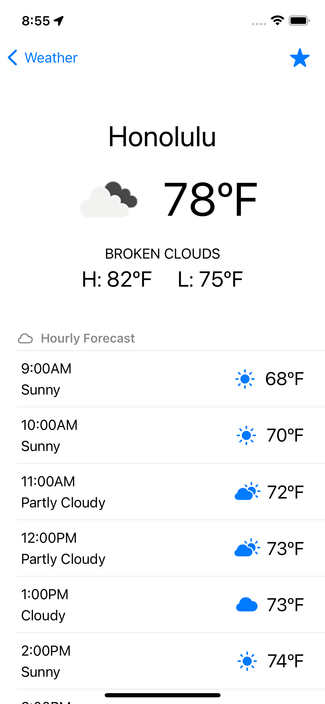

[![Swift Version][swift-image]][swift-url]
[![Build Status][travis-image]][travis-url]
[![License][license-image]][license-url]

# Weather

A simple iOS app that pulls the user's location and displays the current weather using the API provided by [OpenWeatherMap](https://openweathermap.org).

## Features

- [x] Detailed weather information for any location, including current location
- [x] Ability to search for locations by `City, ST` or `Zip Code`
- [x] Ability to add locations as a "Favorite" 
- [x] Adherent to iOS privacy standards
- [x] Simple and easy to use

## Requirements

- iOS 14.0+
- Xcode 13.3

## Installation

This application does *not* require the installation of any external dependencies such as CocoaPods.   

## Usage example

Enable location services on first launch.

## Contributing

Pull requests are welcome. For major changes, please open an issue first to discuss what you would like to change.

Please make sure to update tests as appropriate.

[swift-image]:https://img.shields.io/badge/swift-5.0-orange.svg
[swift-url]: https://swift.org/
[license-image]: https://img.shields.io/badge/License-MIT-blue.svg
[license-url]: https://choosealicense.com/licenses/mit/
[travis-image]: https://img.shields.io/travis/dbader/node-datadog-metrics/master.svg?style=flat-square
[travis-url]: https://travis-ci.org/dbader/node-datadog-metrics

